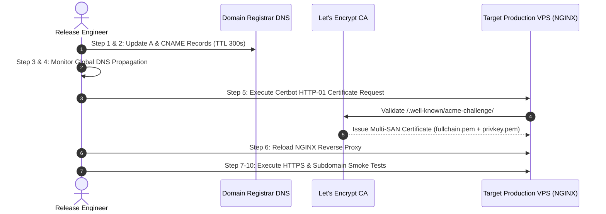

# DNS & HTTPS Cutover Readiness Runbook (IMF-DOS)

**IMAM E MAHDI FOUNDATION** *(Section 8 Not-for-Profit Company | CIN: `U88900DC2026NPL474906`)*  
**Public Brand: IMAM MISSION — *Serving Humanity Beyond Boundaries***  
*Document Version: 1.0.0 | Release Step: 33 DNS & HTTPS Cutover Readiness | Domain: `imammission.org`*

---

## 1. Executive Summary & Architectural Scope

This runbook establishes the exact pre-flight verification, DNS record mappings, Let's Encrypt TLS certificate provisioning workflow, and rollback procedures required to execute a zero-downtime, secure DNS and HTTPS cutover for **IMAM E MAHDI FOUNDATION (IMF-DOS)**.

```mermaid
graph TD
    Registrar[Domain Registrar: Hostinger DNS] -->|DNS A & CNAME Records| VPS[Production VPS Public IPv4]
    
    subgraph "Production Ingress Gateway (Ports 80 & 443)"
        VPS --> NGINX[NGINX Reverse Proxy]
        NGINX -->|HTTP-01 Challenge| Certbot[/var/www/certbot Volume]
        NGINX -->|Host: imammission.org| App1[IMF-DOS Web Ingress :3000]
        NGINX -->|Host: www.imammission.org| Redir[301 Permanent Redirect -> Apex]
        NGINX -->|Host: api.imammission.org| App2[IMF-DOS REST API :3000]
        NGINX -->|Host: admin.imammission.org| App3[IMF-DOS Admin ERP :3000/admin]
    end
    
    LetEncrypt[Let's Encrypt CA] -->|ACME Validation| NGINX
```

---

## 2. Discovered Configuration & Network Findings

| Configuration Dimension | Inspected File / Source | Actual Verified Setting |
| :--- | :--- | :--- |
| **Apex Domain** | [`src/lib/seo/metadata.ts`](file:///Users/shahanwazali/Projects/imam-e-mahdi/src/lib/seo/metadata.ts) | `https://imammission.org` (Canonical Root) |
| **WWW Redirection** | [`src/middleware.ts`](file:///Users/shahanwazali/Projects/imam-e-mahdi/src/middleware.ts) & [`deploy/nginx/nginx.production.conf`](file:///Users/shahanwazali/Projects/imam-e-mahdi/deploy/nginx/nginx.production.conf) | `www.imammission.org` 301 Redirect to `imammission.org` |
| **API Routing** | [`deploy/nginx/nginx.production.conf`](file:///Users/shahanwazali/Projects/imam-e-mahdi/deploy/nginx/nginx.production.conf) | `api.imammission.org` -> `http://app:3000` (Rate: 20r/s) |
| **Admin ERP Routing** | [`deploy/nginx/nginx.production.conf`](file:///Users/shahanwazali/Projects/imam-e-mahdi/deploy/nginx/nginx.production.conf) | `admin.imammission.org` -> `http://app:3000/admin` (WebSocket Support) |
| **ACME Challenge Path**| `deploy/nginx/nginx.production.conf` | `/.well-known/acme-challenge/ -> /var/www/certbot` |
| **Target Production IP**| Hostinger VPS / Ubuntu Server | `<PRODUCTION_VPS_IP>` *(Must be recorded upon VPS boot)* |
| **Authoritative DNS** | Live DNS Query (`dig NS imammission.org`) | `atlas.dns-parking.com`, `hyperion.dns-parking.com` |
| **Cloudflare Status** | Authoritative Nameserver Inspection | **`CLOUDFLARE = NOT IN USE`** *(Hostinger DNS Active)* |

---

## 3. Current Live DNS Audit

Live external DNS resolution test conducted on `2026-09-19`:

| Hostname | Record Type | Current Live Result | Target Expected Result | Status |
| :--- | :--- | :--- | :--- | :--- |
| **`imammission.org`** | `A` | `185.151.30.211` *(Hostinger Parking IP)* | `<PRODUCTION_VPS_IP>` | **PENDING CUTOVER** |
| **`www.imammission.org`** | `CNAME` | `imammission.org.` -> `185.151.30.211` | `imammission.org` | **PENDING CUTOVER** |
| **`api.imammission.org`** | `A` | `NXDOMAIN` *(Unconfigured)* | `<PRODUCTION_VPS_IP>` | **PENDING CREATION** |
| **`admin.imammission.org`**| `A` | `NXDOMAIN` *(Unconfigured)* | `<PRODUCTION_VPS_IP>` | **PENDING CREATION** |

> [!WARNING]
> The apex domain `imammission.org` currently resolves to `185.151.30.211`, which serves an untrusted certificate (`CN=*.stackcp.com`). Let's Encrypt certificates **MUST NOT** be requested until DNS A records have been updated to point directly to `<PRODUCTION_VPS_IP>`.

---

## 4. DNS Cutover Plan & Record Specification

To be configured in the domain registrar's DNS Management Console (Hostinger DNS / Registrar):

| Record Type | Host / Name | Value / Points To | TTL | Purpose |
| :--- | :--- | :--- | :--- | :--- |
| **`A`** | `@` *(or `imammission.org`)* | `<PRODUCTION_VPS_IP>` | `300` *(5 mins)* | Canonical Apex Web Ingress |
| **`CNAME`** | `www` | `imammission.org` | `300` *(5 mins)* | Canonical WWW 301 Redirect |
| **`A`** | `api` | `<PRODUCTION_VPS_IP>` | `300` *(5 mins)* | Dedicated REST API Gateway |
| **`A`** | `admin` | `<PRODUCTION_VPS_IP>` | `300` *(5 mins)* | Executive ERP Control Tower |

> [!IMPORTANT]
> **IPv6 / AAAA POLICY:**  
> Unless a dedicated public IPv6 address is explicitly provisioned, bound to NGINX, and verified on the host network interface, **do NOT create an AAAA record**. An unrouted AAAA record causes severe connection timeouts for dual-stack clients.

---

## 5. Step-by-Step DNS & HTTPS Cutover Runbook



### STEP 1 — Record Current DNS Baseline
Export or document the existing DNS zone records before making modifications:
```bash
# Record existing DNS state for rollback baseline
echo "Apex A: $(dig +short imammission.org)" > /tmp/dns-baseline.txt
echo "WWW CNAME: $(dig +short www.imammission.org)" >> /tmp/dns-baseline.txt
echo "NS: $(dig +short NS imammission.org)" >> /tmp/dns-baseline.txt
cat /tmp/dns-baseline.txt
```

### STEP 2 — Update DNS Records at Registrar
In the Hostinger / Registrar DNS Panel:
1. Edit existing `A` record for `@`: Change IP from `185.151.30.211` to `<PRODUCTION_VPS_IP>`. Set TTL to `300`.
2. Ensure `CNAME` for `www` points to `imammission.org`. Set TTL to `300`.
3. Add new `A` record: Name `api`, Value `<PRODUCTION_VPS_IP>`, TTL `300`.
4. Add new `A` record: Name `admin`, Value `<PRODUCTION_VPS_IP>`, TTL `300`.

### STEP 3 — Wait for DNS Propagation
Allow 5 to 15 minutes for DNS caches and authoritative nameservers to update.

### STEP 4 — Verify DNS Externally
Execute external verification queries from multiple resolver networks:
```bash
# Query Google Public DNS
dig @8.8.8.8 imammission.org +short
dig @8.8.8.8 api.imammission.org +short
dig @8.8.8.8 admin.imammission.org +short
dig @8.8.8.8 www.imammission.org +short

# Query Cloudflare Public DNS
dig @1.1.1.1 imammission.org +short
```
*Verification Condition: All 4 queries must return `<PRODUCTION_VPS_IP>`.*

### STEP 5 — Issue Let's Encrypt TLS Certificate
On the production VPS host (`/var/www/imf-dos`), request a single multi-domain SAN certificate:
```bash
# Run Certbot webroot mode through the shared ACME volume
sudo certbot certonly --webroot \
  -w /var/www/certbot \
  -d imammission.org \
  -d www.imammission.org \
  -d api.imammission.org \
  -d admin.imammission.org \
  --email tech@imammission.org \
  --agree-tos \
  --no-eff-email \
  --rsa-key-size 4096
```
*Expected Output: `Successfully received certificate. Certificate is saved at: /etc/letsencrypt/live/imammission.org/fullchain.pem`.*

### STEP 6 — Reload NGINX
Reload NGINX within the Docker production stack to attach the new certificates:
```bash
cd /var/www/imf-dos
docker compose -f docker-compose.production.yml exec nginx nginx -t
docker compose -f docker-compose.production.yml exec nginx nginx -s reload
```

### STEP 7 — Verify HTTPS TLS Handshake
```bash
curl -Iv https://imammission.org 2>&1 | grep -E "SSL connection|subject:|expire date"
```
*Verification Condition: Returns `SSL connection using TLSv1.3` and `subject: CN=imammission.org`.*

### STEP 8 — Verify All Subdomains
```bash
# 1. Verify API Subdomain
curl -Iv https://api.imammission.org/api/health 2>&1 | grep -E "HTTP/2|HTTP/1.1|status"

# 2. Verify Admin Subdomain
curl -Iv https://admin.imammission.org 2>&1 | grep -E "HTTP/2|HTTP/1.1 200"

# 3. Verify WWW Canonical 301 Redirect
curl -Iv https://www.imammission.org 2>&1 | grep -E "HTTP/2 301|location:"
```

### STEP 9 — Verify Global HTTP → HTTPS 301 Redirection
```bash
curl -I http://imammission.org
curl -I http://api.imammission.org
curl -I http://admin.imammission.org
```
*Verification Condition: All return `HTTP/1.1 301 Moved Permanently` with `Location: https://...`.*

### STEP 10 — Run Production Smoke Tests
```bash
cd /var/www/imf-dos
docker compose -f docker-compose.production.yml exec app npx tsx scripts/verify-post-deployment.ts
```
*Verification Condition: All 10 post-deployment checks pass with 100% success.*

---

## 6. Emergency Rollback Procedure

If certificate issuance fails, NGINX routing degrades, or the application becomes unreachable during cutover:

```bash
# ------------------------------------------------------------------------------
# EMERGENCY DNS ROLLBACK STEPS
# ------------------------------------------------------------------------------

# 1. Immediately revert DNS A record at Registrar:
#    Change @ (imammission.org) from <PRODUCTION_VPS_IP> back to:
#    CURRENT_DNS_VALUE_REQUIRED: 185.151.30.211

# 2. Remove broken subdomains if necessary:
#    Delete A record: api -> <PRODUCTION_VPS_IP>
#    Delete A record: admin -> <PRODUCTION_VPS_IP>

# 3. Revert WWW CNAME:
#    Ensure www CNAME points to imammission.org

# 4. Check local container logs to diagnose failure:
cd /var/www/imf-dos
docker compose -f docker-compose.production.yml logs --tail=100 nginx
docker compose -f docker-compose.production.yml logs --tail=100 app

# 5. Flush local DNS cache and verify rollback:
dig @8.8.8.8 imammission.org +short
```

---

## 7. Security & Cutover Sign-Off

```
========================================================================================
  IMAM E MAHDI FOUNDATION DIGITAL OPERATING SYSTEM (IMF-DOS)
  DNS & HTTPS CUTOVER READINESS VERIFICATION
========================================================================================
  Target Domain:            imammission.org (and subdomains: www, api, admin)
  DNS Configuration:        READY (Exact A & CNAME records specified with TTL 300s)
  DNS Cutover Status:       PENDING INSTRUCTION (No DNS modifications made)
  TLS / NGINX Readiness:    READY (TLS 1.3, HSTS, Rate Limiting & ACME Webroot Configured)
  Certificates:             PENDING DNS PROPAGATION (Let's Encrypt HTTP-01 Ready)
  Live Payment Status:      DISABLED (Safe harbor active)
========================================================================================
```
