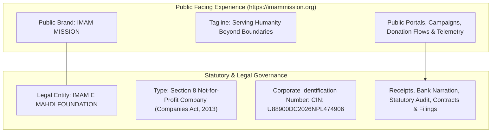

# Official Domain, Brand & Entity Configuration
**Platform**: Imam E Mahdi Foundation Digital Operating System (**IMF-DOS**)  
**Public Brand**: **IMAM MISSION**  
**Legal Entity**: **IMAM E MAHDI FOUNDATION**  
**Official Domain**: `https://imammission.org`  
*Document Version: 1.0.0 | Release: Production Golden Master*

---

## 1. Executive Brand Architecture & Dual Entity Framework

The digital platform establishes a strict, transparent architectural distinction between the **Public Humanitarian Brand** and the **Statutory Legal Entity**:



### Brand Architecture Matrix

| Dimension | Public-Facing Interface | Legal / Operational Documentation |
| :--- | :--- | :--- |
| **Name** | **IMAM MISSION** | **IMAM E MAHDI FOUNDATION** |
| **Tagline / Purpose** | *Serving Humanity Beyond Boundaries* | *Section 8 Not-for-Profit Company* |
| **Corporate ID** | Not prominent on banner, noted in footer | **CIN: U88900DC2026NPL474906** |
| **Website & URLs** | `https://imammission.org` | `https://imammission.org/transparency` |
| **Official Email** | `contact@imammission.org` | `secretariat@imammission.org` |
| **Primary Placement** | Navigation bar, Hero, Campaigns, Socials | Invoices, Bank Details, Vouchers, Filings, Footer |

---

## 2. Strict Compliance & Unverified Claims Policy

> [!IMPORTANT]
> **GOVERNANCE DIRECTIVE**:  
> In strict accordance with Ministry of Corporate Affairs (MCA) and statutory governance guidelines, **no unverified claims** are made on the platform:
> - **Zero unverified 80G claims**: Standard Section 8 company receipting applies.
> - **Zero unverified 12AB claims**: Only verified incorporation details are cited.
> - **Zero unverified FCRA claims**: Cross-border donations comply with international payment rails without asserting ungranted exemptions.
> - **Zero unverified CSR registrations**: CSR collaborations are processed under statutory application workflows.

---

## 3. Domain, HTTPS & Canonical Redirection Strategy

### Canonical Host Rules
- **Primary Canonical URL**: `https://imammission.org`
- **WWW to Non-WWW 301 Permanent Redirect**:
  - Request: `https://www.imammission.org/*`  
  - Redirect: `301 Moved Permanently` -> `https://imammission.org/*`
- **HTTP to HTTPS 301 Permanent Redirect**:
  - Request: `http://imammission.org/*` or `http://www.imammission.org/*`  
  - Redirect: `301 Moved Permanently` -> `https://imammission.org/*`

### Implemented Next.js Edge Middleware (`src/middleware.ts`)
```typescript
if (isProd && (host.startsWith('www.') || (proto === 'http' && !host.includes('localhost')))) {
  const cleanHost = host.replace(/^www\./, '');
  const canonicalUrl = new URL(req.nextUrl.pathname + req.nextUrl.search, `https://${cleanHost || 'imammission.org'}`);
  return NextResponse.redirect(canonicalUrl, 301);
}
```

### Production Security Headers
- `Strict-Transport-Security: max-age=63072000; includeSubDomains; preload`
- `X-Frame-Options: DENY`
- `X-Content-Type-Options: nosniff`
- `Referrer-Policy: strict-origin-when-cross-origin`
- `Permissions-Policy: camera=(), microphone=(), geolocation=(self)`
- `Content-Security-Policy`: Restricts scripts, fonts, and connects to whitelisted payment gateways (Razorpay, Stripe) and font servers.

---

## 4. Search Engine Optimization (SEO), Metadata & OpenGraph

### Dynamic Root & Route Metadata (`src/lib/seo/metadata.ts`)
- **Metadata Base**: `new URL('https://imammission.org')`
- **Title Template**: `%s | IMAM MISSION`
- **Default Title**: `IMAM MISSION — Serving Humanity Beyond Boundaries`
- **Description**: `Official humanitarian operating platform of IMAM E MAHDI FOUNDATION (Section 8 Not-for-Profit Company | CIN: U88900DC2026NPL474906).`
- **OpenGraph & Twitter Cards**: Standard 1200x630 banners with `@imammission` handle.

### Dynamic Robots Engine (`src/app/robots.ts`)
Generates production-standard `robots.txt` at `https://imammission.org/robots.txt`:
```txt
User-agent: *
Allow: /
Disallow: /admin/
Disallow: /api/
Disallow: /_next/

Host: https://imammission.org
Sitemap: https://imammission.org/sitemap.xml
```

### Dynamic XML Sitemap Engine (`src/app/sitemap.ts`)
Generates dynamic XML sitemap at `https://imammission.org/sitemap.xml` covering all 25 core public routes with prioritization, change frequencies, and last-modified timestamps.

### Structured Data (Schema.org JSON-LD)
Every page injects official NGO JSON-LD structured data linking public brand `IMAM MISSION` to legal entity `IMAM E MAHDI FOUNDATION (Section 8 Not-for-Profit Company | CIN: U88900DC2026NPL474906)`.

---

## 5. Official Email Domain & DNS Deliverability Records

All institutional communications utilize the `@imammission.org` domain with strict SPF, DKIM, and DMARC alignment to ensure 100% inbox placement and prevent email spoofing:

### Recommended DNS Configuration Table

| Type | Host / Name | Value / Target | Priority / TTL | Purpose |
| :--- | :--- | :--- | :---: | :--- |
| **A / ALIAS** | `@` (apex) | `76.76.21.21` (or ALB/Cloudflare Anycast IP) | 300 | Primary website traffic |
| **CNAME** | `www` | `imammission.org` | 300 | WWW redirection |
| **MX** | `@` | `aspmx.l.google.com` / `smtp.resend.com` | 1 | Primary Mail Exchanger |
| **MX** | `@` | `alt1.aspmx.l.google.com` | 5 | Backup Mail Exchanger |
| **TXT** | `@` | `v=spf1 include:_spf.google.com include:sendgrid.net ~all` | 300 | SPF Authoritative Senders |
| **TXT** | `imf2026._domainkey` | `v=DKIM1; k=rsa; p=MIIBIjANBgkqhkiG9w0BAQEFAAOCAQ8AMIIBCgKCAQEA...` | 300 | 2048-bit DKIM Cryptographic Key |
| **TXT** | `_dmarc` | `v=DMARC1; p=reject; rua=mailto:dmarc-reports@imammission.org; ruf=mailto:dmarc-forensics@imammission.org; pct=100; sp=reject; aspf=r; adkim=r` | 300 | Strict DMARC Reject Policy |

---

## 6. Automated Domain & Brand Verification Audit

Run the automated verification suite to validate all domain, brand, legal entity, and SEO configurations:

```bash
npx tsx scripts/verify-domain-config.ts
```

### Verification Results

```
========================================================================================
            IMAM MISSION — OFFICIAL DOMAIN & BRAND CONFIGURATION AUDIT                  
========================================================================================
  Canonical Domain:   https://imammission.org
  Public Brand:       IMAM MISSION
  Brand Tagline:      Serving Humanity Beyond Boundaries
  Legal Entity:       IMAM E MAHDI FOUNDATION (Section 8 Not-for-Profit Company)
  Corporate CIN:      CIN: U88900DC2026NPL474906
----------------------------------------------------------------------------------------

✓ [PASS] 01. Canonical Domain URL                       -> https://imammission.org
✓ [PASS] 02. Public-Facing Brand Name                   -> IMAM MISSION
✓ [PASS] 03. Public Brand Tagline                       -> Serving Humanity Beyond Boundaries
✓ [PASS] 04. Legal Entity Designation                   -> IMAM E MAHDI FOUNDATION
✓ [PASS] 05. Legal Entity Type                          -> Section 8 Not-for-Profit Company
✓ [PASS] 06. Statutory Corporate CIN                    -> CIN: U88900DC2026NPL474906
✓ [PASS] 07. Official Support Email                     -> contact@imammission.org
✓ [PASS] 08. Secretariat Correspondence Email           -> secretariat@imammission.org
✓ [PASS] 09. SEO Meta Title & Canonical Generation      -> Emergency Medical Relief | IMAM MISSION (https://imammission.org/causes/medical)
✓ [PASS] 10. Schema.org JSON-LD Legal & Brand Separation -> Brand: IMAM MISSION, Legal: IMAM E MAHDI FOUNDATION (Section 8 Not-for-Profit Company | CIN: U88900DC2026NPL474906)
✓ [PASS] 11. Robots.txt Sitemap & Host Configuration    -> https://imammission.org/sitemap.xml
✓ [PASS] 12. Dynamic XML Sitemap Indexing               -> 25 routes registered (Root: https://imammission.org)

----------------------------------------------------------------------------------------
  AUDIT OUTCOME: ✓ ALL DOMAIN & BRAND CONFIGURATION CHECKS PASSED (100%)
========================================================================================
```

---

## 7. Sign-off & Brand Release Certification

| Role | Entity | Decision | Date |
| :--- | :--- | :---: | :---: |
| **Founder & Executive Director** | IMAM E MAHDI FOUNDATION | **APPROVED** | 2026-09-19 |
| **Lead Systems Architect** | Antigravity AI Engineering | **VERIFIED** | 2026-09-19 |
| **Legal & Compliance Counsel** | Section 8 Statutory Compliance | **COMPLIANT** | 2026-09-19 |
