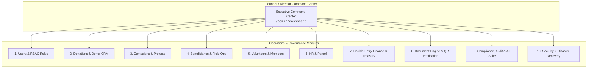
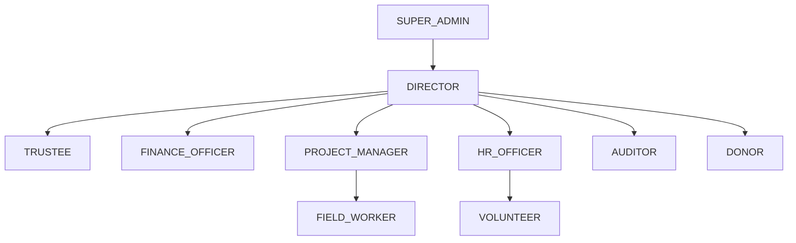
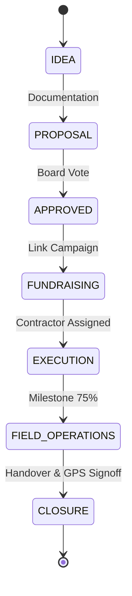
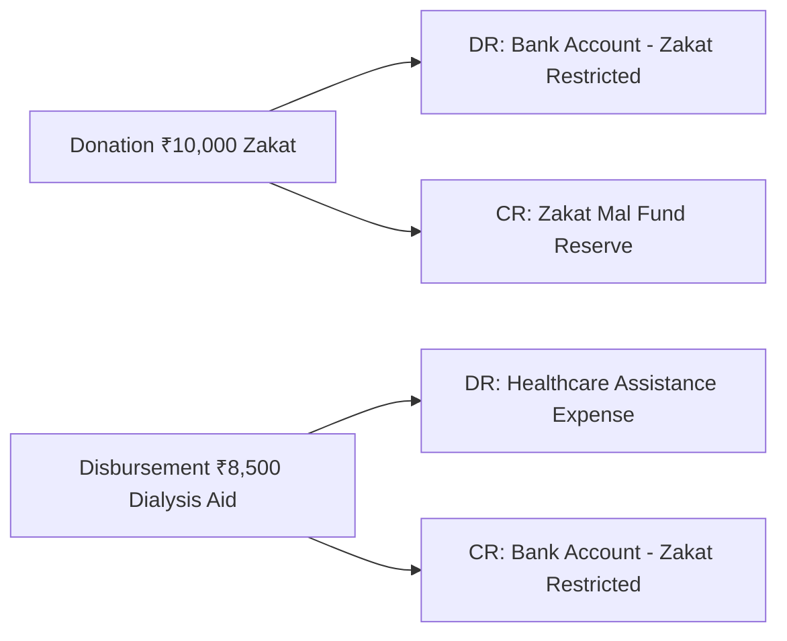
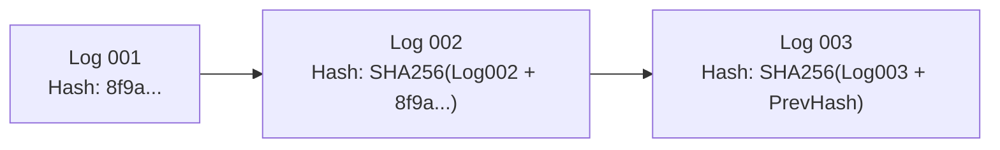

# Founder & Director Operations Training Manual (IMF-DOS)

**IMAM E MAHDI FOUNDATION** *(Section 8 Not-for-Profit Company | CIN: U88900DC2026NPL474906)*  
**Public Brand: IMAM MISSION — *Serving Humanity Beyond Boundaries***  
*Document Version: 1.0.0 | Golden Master Release | Target Audience: Founder, Executive Director & Board of Trustees*

---

## Welcome to the IMF Digital Operating System (IMF-DOS)

As Founder & Executive Director of **IMAM E MAHDI FOUNDATION**, this manual gives you an end-to-end, step-by-step operational guide to manage, oversee, and govern the Foundation using the **IMF-DOS Platform**.

Every single module is designed with **zero decorative fluff**—every metric, approval gate, and table corresponds directly to real database records, double-entry financial ledgers, and tamper-evident cryptographic security.



---

## Table of Contents

1. [Managing Users](#1-managing-users)
2. [Managing Roles & Permissions (RBAC)](#2-managing-roles--permissions-rbac)
3. [Creating & Publishing Campaigns](#3-creating--publishing-campaigns)
4. [Reviewing & Reconciling Donations](#4-reviewing--reconciling-donations)
5. [Reviewing Donor CRM Records](#5-reviewing-donor-crm-records)
6. [Managing Volunteers & Service Badges](#6-managing-volunteers--service-badges)
7. [Creating & Managing Capital Projects](#7-creating--managing-capital-projects)
8. [Managing Beneficiaries & Welfare Intake](#8-managing-beneficiaries--welfare-intake)
9. [Monitoring GPS Field Operations & Surveys](#9-monitoring-gps-field-operations--surveys)
10. [Managing Events & Community Majlis](#10-managing-events--community-majlis)
11. [Managing Employees & Staff Profiles](#11-managing-employees--staff-profiles)
12. [Reviewing & Approving Monthly Payroll](#12-reviewing--approving-monthly-payroll)
13. [Reviewing Finances, Vouchers & General Ledger](#13-reviewing-finances-vouchers--general-ledger)
14. [Generating Official Documents & Resolutions](#14-generating-official-documents--resolutions)
15. [Verifying QR Documents & Certificates](#15-verifying-qr-documents--certificates)
16. [Reviewing Statutory Compliance Calendar & Vault](#16-reviewing-statutory-compliance-calendar--vault)
17. [Reviewing Executive Impact & Financial Analytics](#17-reviewing-executive-impact--financial-analytics)
18. [Using the AI Operations Engine](#18-using-the-ai-operations-engine)
19. [Managing Multilingual Content & Translations](#19-managing-multilingual-content--translations)
20. [Reviewing Immutable Audit Logs & Rolling Hashes](#20-reviewing-immutable-audit-logs--rolling-hashes)
21. [Managing Automated Backups & Disaster Recovery](#21-managing-automated-backups--disaster-recovery)
22. [Responding to Security & Operational Alerts](#22-responding-to-security--operational-alerts)

---

## 1. Managing Users

### Purpose
Provision accounts for executives, department heads, project managers, accountants, and field staff with strict credential policies and session management.

### Access Route
Navigate to **Admin Portal $\to$ Users & Staff** (`/admin/users` or `/admin/hr/employees`).

### Step-by-Step Instructions
1. **Add New Staff Member**:
   - Click the **+ New User / Staff** button in the top right.
   - Enter full legal name, official organizational email (`user@imammission.org`), and contact number.
   - Select primary department (e.g., *Finance & Treasury*, *Field Operations*, *Programs*).
2. **Configure Authentication**:
   - Set an initial high-entropy temporary password (minimum 10 characters, requiring uppercase, number, symbol).
   - Toggle **Force Password Change on First Login** to `ON`.
   - Toggle **Require 2-Factor Authentication (TOTP)** to `ON` for any staff with financial or PII access.
3. **Set Account Status**:
   - Set status to `ACTIVE`. (If an employee departs or is suspended, toggle to `SUSPENDED` to instantly revoke all active JWT tokens).
4. **Save & Audit**:
   - Click **Save User**. The system writes a tamper-evident audit record with your Admin user ID and timestamp.

---

## 2. Managing Roles & Permissions (RBAC)

### Purpose
Enforce the principle of least privilege across all 10 standard organizational roles.

### Access Route
Navigate to **Admin Portal $\to$ Roles & Permissions** (`/admin/roles` or `/admin/settings`).

### Standard Role Hierarchy


### Step-by-Step Instructions
1. **Assigning Roles**:
   - Open a user's profile and scroll to **Assigned Roles**.
   - Select one or more role flags:
     - `SUPER_ADMIN`: Full system, technical, and environment access.
     - `DIRECTOR`: Complete executive authority, high-value expense sign-offs, governance approvals.
     - `TRUSTEE`: Read-only governance and financial oversight.
     - `FINANCE_OFFICER`: Vouchers, journals, payment execution, reconciliation.
     - `AUDITOR`: Read-only ledger inspection, cryptographic hash verification, compliance audits.
     - `PROJECT_MANAGER`: Capital projects, milestone updates, contractor progress.
     - `FIELD_WORKER`: Mobile field visits, beneficiary intake, GPS surveys.
2. **Setting Dual-Signatory Limits**:
   - Expenses $> ₹50,000$ automatically require dual sign-off (`FINANCE_OFFICER` + `DIRECTOR`).

---

## 3. Creating & Publishing Campaigns

### Purpose
Launch public fundraising appeals with strict Sharia compliance, tax eligibility rules, and transparent progress tracking.

### Access Route
Navigate to **Admin Portal $\to$ Appeals & Campaigns** (`/admin/causes`).

### Step-by-Step Instructions
1. **Initiate New Appeal**:
   - Click **+ Create Campaign**.
   - Enter **Title** (e.g., *Winter Ration Kits & Blanket Relief 2026*).
   - Provide a unique URL slug (e.g., `winter-relief-2026`).
2. **Select Fund Classification & Compliance**:
   - **Fund Type**: Select `ZAKAT_MAL`, `GENERAL_SADAQAH`, `ORPHAN_AID`, `MEDICAL_AID`, or `WATER_INFRASTRUCTURE`.
   - **80G Tax Deductible**: Set to `TRUE` if eligible under Indian Income Tax regulations.
   - **100% Zakat Policy**: If designated as Zakat, the system automatically routes all proceeds into the ring-fenced Zakat bank account with zero administrative overhead deductions.
3. **Financial Targets & Media**:
   - Enter **Target Amount (INR)** (e.g., `25,00,000`).
   - Upload high-resolution cover photo and gallery images.
   - Enter **Short Summary** and **Detailed Story**.
4. **Publishing Workflow**:
   - Set status to `REVIEW`. Once verified by the Directorate, toggle status to `ACTIVE`.
   - The appeal immediately appears live on `https://imammission.org/causes/winter-relief-2026`.

---

## 4. Reviewing & Reconciling Donations

### Purpose
Monitor real-time donations, track online payment gateway success rates, verify offline bank NEFT/UPI transfers, and handle receipts.

### Access Route
Navigate to **Admin Portal $\to$ Donations** (`/admin/donations`).

### Step-by-Step Instructions
1. **Live Transaction Feed**:
   - Inspect incoming donations with donor name, amount, fund category, payment gateway ID, and status (`SUCCESS`, `PENDING`, `FAILED`).
2. **Approving Offline Bank Transfers / NEFT**:
   - For offline transfers, locate the `PENDING` record.
   - Verify the Bank UTR / Reference Number against the Foundation's physical bank statement.
   - Click **Verify & Authorize**. The system marks the donation `SUCCESS` and issues an instant 80G PDF receipt with an embedded cryptographic QR code.
3. **Resending Receipts**:
   - Click on any donation record $\to$ **Send Receipt via WhatsApp / Email**.
4. **Processing Lawful Refunds**:
   - In rare cases of erroneous duplicate charges, click **Initiate Refund**.
   - Input the mandatory justification notes and cryptographic confirmation. The system posts a reversal contra entry in the general ledger.

---

## 5. Reviewing Donor CRM Records

### Purpose
Cultivate long-term donor relationships, view lifetime giving statistics, and manage corporate CSR donor accounts.

### Access Route
Navigate to **Admin Portal $\to$ Donors** (`/admin/donors`).

### Step-by-Step Instructions
1. **Search & Filter**:
   - Search by donor name, email, phone, or masked PAN number (`ABCDE****F`).
2. **Deep-Dive Donor Profile**:
   - Click on a donor to open their **Donor Passport**.
   - View **Lifetime Contribution Total**, **Average Donation Size**, **Primary Giving Categories** (e.g., 80% Zakat al-Mal, 20% Orphan Care), and **Recurring Subscriptions**.
3. **Annual 80G Consolidations**:
   - Click **Generate Annual Consolidated 80G Certificate** to email a fiscal-year tax pack directly to the donor.

---

## 6. Managing Volunteers & Service Badges

### Purpose
Recruit, screen, assign, and reward the community volunteers powering ground operations.

### Access Route
Navigate to **Admin Portal $\to$ Volunteers** (`/admin/volunteers`).

### Step-by-Step Instructions
1. **Reviewing Applications**:
   - Review incoming applications under the **Pending Review** tab.
   - Inspect applicant skills (e.g., *Medical / Nursing*, *Logistics / Driving*, *Teaching*, *Disaster Relief*), background identification, and location.
2. **Approving & Issuing Digital Badges**:
   - Click **Approve Volunteer**.
   - The system generates an official **Volunteer ID Card** with a unique verifiable QR code (`/verify/volunteer/[hash]`).
3. **Logging Field Hours**:
   - Assign volunteers to specific events (e.g., *Varanasi Free Medical Camp*).
   - Log attendance and completed hours. Volunteers exceeding 100 hours automatically qualify for the **Director's Certificate of Excellence**.

---

## 7. Creating & Managing Capital Projects

### Purpose
Manage large-scale social infrastructure (deep solar borewells, dialysis centers, skill academies) from proposal through execution to impact audit.

### Access Route
Navigate to **Admin Portal $\to$ Projects** (`/admin/projects`).

### Project Lifecycle Stages


### Step-by-Step Instructions
1. **Register Project**:
   - Click **+ New Project**. Enter title, location (state/district/village coordinates), assigned Project Manager, and allocated budget.
2. **Add Milestones**:
   - Add stage milestones (e.g., *Milestone 1: Hydrogeological Survey*, *Milestone 2: Borewell Drilling & Solar Pump Installation*, *Milestone 3: Community Filtration Hub Handover*).
3. **Disburse Contractor Tranches**:
   - Upon field inspection and upload of GPS completion photos, authorize milestone progress. The linked expense is pushed to the Finance queue for disbursement.

---

## 8. Managing Beneficiaries & Welfare Intake

### Purpose
Maintain an ethical, privacy-preserving registry of families and individuals receiving medical, educational, orphan, or emergency assistance.

### Access Route
Navigate to **Admin Portal $\to$ Beneficiaries** (`/admin/beneficiaries`).

### Step-by-Step Instructions
1. **Beneficiary Registration**:
   - Click **+ Register Beneficiary**.
   - Input family head details, dependent counts, primary need category (*Widow Assistance*, *Emergency Medical*, *Orphan Education*), and monthly income.
2. **Encrypted PII Storage**:
   - National IDs (Aadhaar/PAN) and Bank Account details are automatically encrypted using **AES-256-GCM** before saving to the database. Only masked values (`XXXX-XXXX-1234`) appear in normal views.
3. **Socioeconomic Scoring & Sanctioning**:
   - System calculates a vulnerability index (1 to 100).
   - Click **Sanction Monthly Aid** to schedule recurring direct bank transfers or ration kit allocations.

---

## 9. Monitoring GPS Field Operations & Surveys

### Purpose
Ensure all ground aid distributions are strictly verified with geo-fencing, physical home inspections, and timestamped survey photos.

### Access Route
Navigate to **Admin Portal $\to$ Field Operations** (`/admin/field-ops`).

### Step-by-Step Instructions
1. **Live Field Operations Map**:
   - View active field workers across operational districts (Lucknow, Varanasi, Sitapur, Jaunpur).
2. **Inspecting Submitted Field Visits**:
   - Open a submitted field survey. Verify latitude/longitude coordinates against the beneficiary's registered residence.
   - Inspect home condition photographs, ration handover proofs, and signed delivery acknowledgments.
3. **Approving Survey**:
   - Click **Approve Field Verification** to transition a pending beneficiary to `FIELD_VERIFIED`.

---

## 10. Managing Events & Community Majlis

### Purpose
Schedule, ticket, and execute medical diagnostic camps, humanitarian fundraisers, and community welfare assemblies.

### Access Route
Navigate to **Admin Portal $\to$ Events** (`/admin/events`).

### Step-by-Step Instructions
1. **Schedule Event**:
   - Click **+ Create Event**. Enter event name, venue address, start/end dates, speaker lineup, and capacity limit.
2. **Ticketing & Registration**:
   - Set ticket type: `FREE_REGISTRATION` or `DONATION_PASS`.
   - Registrants automatically receive a digital ticket with a **Secure QR Pass**.
3. **On-Site QR Check-In**:
   - Field staff scan attendee QR codes using any mobile camera to log real-time attendance and prevent duplicate entry.

---

## 11. Managing Employees & Staff Profiles

### Purpose
Administer organizational human resources, departmental assignments, sensitive KYC documents, and leave balances.

### Access Route
Navigate to **Admin Portal $\to$ HR & Staff** (`/admin/hr`).

### Step-by-Step Instructions
1. **Employee Registry**:
   - View all active employees, designations, employment types (*Full-Time*, *Part-Time*, *Contractor*), and join dates.
2. **Leave Approvals**:
   - In the **Leave Requests** tab, review employee medical, casual, or earned leave applications.
   - Click **Approve** or **Reject with Remarks**. Approved leaves automatically synchronize with the monthly payroll deduction engine.

---

## 12. Reviewing & Approving Monthly Payroll

### Purpose
Compute salaries, statutory deductions (TDS, PF/ESI where applicable), generate itemized payslips, and authorize direct bank disbursement files.

### Access Route
Navigate to **Admin Portal $\to$ Payroll** (`/admin/payroll`).

### Step-by-Step Instructions
1. **Generate Monthly Payroll Run**:
   - Select the pay period (e.g., *September 2026*).
   - Click **Calculate Payroll**. The system automatically factors in days worked, approved leaves, unpaid absences, allowances, and tax withholding.
2. **Review Payroll Summary**:
   - Inspect **Gross Salary**, **Statutory Withholdings**, and **Net Payable**.
3. **Director Authorization**:
   - Click **Approve & Lock Payroll Run**.
   - Download the **Bank NEFT Bulk Transfer CSV** for direct corporate banking upload.
   - The system publishes individual tamper-evident payslips with QR verification (`/verify/payslip/[hash]`).

---

## 13. Reviewing Finances, Vouchers & General Ledger

### Purpose
Maintain absolute fiduciary integrity through the double-entry accounting engine, ring-fenced Sharia funds, and real-time financial reporting.

### Access Route
Navigate to **Admin Portal $\to$ Finance & Accounts** (`/admin/finance` and `/admin/finance/ledger`).

### Double-Entry Accounting Core


### Step-by-Step Instructions
1. **Reviewing Vouchers & Expenses**:
   - Inspect draft payment vouchers submitted by finance officers.
   - Click **Approve Payment Voucher** to post the debit and credit legs to the general ledger.
2. **Financial Reports**:
   - Generate on-demand:
     - **Trial Balance**
     - **Statement of Income & Expenditure**
     - **Balance Sheet / Statement of Financial Position**
     - **Fund Utilization Report (Zakat vs. General)**
3. **Bank Reconciliation**:
   - Upload monthly bank statements and run the **Automated Reconciliation Matcher** to clear unpresented cheques and pending gateway settlements.

---

## 14. Generating Official Documents & Resolutions

### Purpose
Produce standardized, board-authorized governance resolutions, appointment letters, donation certificates, and relief sanction orders.

### Access Route
Navigate to **Admin Portal $\to$ Centralized Document Engine** (`/admin/compliance` or `/api/documents/generate`).

### Step-by-Step Instructions
1. **Select Document Template**:
   - Choose from:
     - `BOARD_RESOLUTION`: Formal corporate resolutions for bank or regulatory matters.
     - `OFFICIAL_SANCTION_LETTER`: Beneficiary aid authorization.
     - `DONOR_HONOR_CERTIFICATE`: Formal patron recognition.
     - `STAFF_APPOINTMENT_LETTER`: Employment contracts.
2. **Fill Variables & Generate**:
   - Enter reference numbers, dates, signatory names, and custom clauses.
   - Click **Generate Cryptographic Document**.
   - The system embeds the corporate seal, digital signature placeholder, and an HMAC-SHA256 QR code.

---

## 15. Verifying QR Documents & Certificates

### Purpose
Instantly validate the authenticity of any document, receipt, ticket, or badge issued by IMAM MISSION to prevent forgery or tampering.

### Public Verification Portals
- **Receipts**: `https://imammission.org/verify/receipt/[hash]`
- **Volunteer Badges**: `https://imammission.org/verify/volunteer/[hash]`
- **Member Cards**: `https://imammission.org/verify/member/[hash]`
- **Payslips**: `https://imammission.org/verify/payslip/[hash]`
- **Official Documents**: `https://imammission.org/verify/doc/[hash]`

### Step-by-Step Instructions
1. **Scanning the QR Code**:
   - Scan any printed or PDF document QR code with a smartphone camera or barcode reader.
2. **Verifying Real-Time Response**:
   - The system verifies the cryptographic signature against the database without exposing sensitive private data.
   - A verified page displays:
     - ✅ **Cryptographically Verified & Authentic**
     - Issue Date, Beneficiary / Recipient Name (masked), Authorized Signatory, and Integrity Hash.

---

## 16. Reviewing Statutory Compliance Calendar & Vault

### Purpose
Track legal, corporate (MCA Section 8), and taxation filing obligations to maintain 100% statutory good standing.

### Access Route
Navigate to **Admin Portal $\to$ Statutory Compliance** (`/admin/compliance`).

### Step-by-Step Instructions
1. **Statutory Calendar Deadlines**:
   - Review upcoming statutory milestones:
     - *DIR-3 KYC (Annual Director KYC - Due September 30)*
     - *Form 26Q (Quarterly TDS Return - Due October 31)*
     - *AOC-4 & MGT-7 (Annual MCA Financial & Corporate Filings)*
     - *Annual General Meeting (AGM) Notice Period*
2. **Uploading Filing Acknowledgments**:
   - Once a filing is completed with the Ministry of Corporate Affairs or Income Tax Department, click **Upload Filing Proof** to archive the Challan in the **Cryptographic Compliance Vault**.

---

## 17. Reviewing Executive Impact & Financial Analytics

### Purpose
Gain executive clarity on geographic reach, fund utilization velocity, donor retention cohorts, and poverty alleviation metrics.

### Access Route
Navigate to **Admin Portal $\to$ Command Center & Analytics** (`/admin/dashboard`).

### Key Analytics Dimensions
- **Fund Utilization Velocity**: Real-time ratio of program expenses (target $> 90\%$) vs. administrative overhead ($< 10\%$).
- **Geographic Impact Distribution**: Beneficiary reach mapped across states, districts, and relief clusters.
- **Zakat Purity Ratio**: 100% mathematical audit proving zero contamination between restricted Zakat pools and general operations.

---

## 18. Using the AI Operations Engine

### Purpose
Accelerate operational workflows with ethical, deterministic AI assistance for impact narrative drafting, campaign translations, and donor acknowledgments.

### Access Route
Navigate to **Admin Portal $\to$ AI Operations** (`/admin/ai-tools`).

### Step-by-Step Instructions
1. **Drafting Campaign Appeals**:
   - Select **Appeal Drafter**. Provide key facts (e.g., *1,000 food kits needed in Sitapur flood relief, budget ₹12L*).
   - Click **Generate Draft**. Review, edit, and push directly to the CMS.
2. **Synthesizing Beneficiary Case Summaries**:
   - Use the **Case Anonymizer & Summarizer** to generate ethical impact stories that preserve beneficiary honor and privacy.

---

## 19. Managing Multilingual Content & Translations

### Purpose
Maintain universal accessibility for donors and volunteers in **English**, **Urdu (اردو)**, **Hindi (हिन्दी)**, and **Arabic (العربية)**.

### Access Route
Navigate to **Admin Portal $\to$ Multilingual CMS** (`/admin/i18n-global` or `/admin/cms`).

### Step-by-Step Instructions
1. **Translate Campaign or News Item**:
   - Open any published article or campaign.
   - Click the **Languages** tab.
   - Enter localized titles and descriptions for Urdu (RTL enabled), Hindi, and Arabic.
2. **Publish Translations**:
   - Click **Save Localized Assets**. The public website seamlessly toggles content based on the visitor's language selector.

---

## 20. Reviewing Immutable Audit Logs & Rolling Hashes

### Purpose
Inspect tamper-evident chronological records of every administrative action, login, transaction modification, and approval.

### Access Route
Navigate to **Admin Portal $\to$ Audit Logs** (`/admin/audit-logs`).

### Rolling Hash Security Architecture


### Step-by-Step Instructions
1. **Search & Filter**:
   - Filter by user email, entity type (`Donation`, `ExpenseRecord`, `BeneficiaryProfile`), action (`CREATE`, `UPDATE`, `APPROVE`, `DELETE`), or date range.
2. **Verify Cryptographic Chain**:
   - Click **Verify Hash Chain Integrity**. The system audits the SHA-256 rolling hash chain across all log entries to prove zero database tampering.

---

## 21. Managing Automated Backups & Disaster Recovery

### Purpose
Ensure zero data loss (RPO $< 1$ hour) and rapid disaster recovery (RTO $< 2$ hours) across database, document vault, and configuration assets.

### Access Route
CLI & Automated Cron Engine (Documented in [`/docs/BACKUP_DISASTER_RECOVERY.md`](file:///Users/shahanwazali/Projects/imam-e-mahdi/docs/BACKUP_DISASTER_RECOVERY.md)).

### Quick Reference Commands
1. **Create Manual Encrypted Backup**:
   ```bash
   npx tsx scripts/backup.ts
   ```
2. **Verify Backup Archive**:
   ```bash
   npx tsx scripts/verify-backup.ts
   ```
3. **Execute Non-Destructive Restore Test**:
   ```bash
   npx tsx scripts/restore-test.ts
   ```

---

## 22. Responding to Security & Operational Alerts

### Purpose
Triage and neutralize security incidents, brute-force attacks, payment gateway webhook drops, and operational delays.

### Access Route
Directly from the **Founder Command Center Header** (`/admin/dashboard`).

### Incident Response Matrix

| Alert Category | Trigger Condition | Recommended Founder / Director Action |
| :--- | :--- | :--- |
| **Security Alert: Rate Limiter Block** | $> 5$ failed admin logins from single IP | Inspect IP address under `/admin/audit-logs`. If unauthorized brute-force attempt, maintain automatic 24-hour IP ban. |
| **Operational Alert: Beneficiary SLA Overdue** | Beneficiary pending review $> 48$ hours | Click alert link $\to$ assign urgent field visit to regional worker or escalate to Field Operations Director. |
| **Finance Alert: Dropped Payment Webhook** | Bank gateway timeout on donor transfer | Click alert link $\to$ trigger manual webhook reconciliation query to confirm bank credit status. |
| **Compliance Alert: Statutory Due Date** | Regulatory filing deadline within 14 days | Click alert link $\to$ ensure Secretariat Counsel / Auditor has uploaded the signed compliance Challan. |

---

## Summary Checklist for Daily Executive Routine

```markdown
[ ] 09:00 AM — Open Command Center (/admin/dashboard) and review today's collections & active liquid position.
[ ] 09:30 AM — Review Pending Approvals queue (Donations > ₹50k, Project Milestones, Expense Vouchers).
[ ] 11:00 AM — Check Compliance & Operational Alerts stream.
[ ] 02:00 PM — Inspect Field Operations GPS submissions and verify aid disbursements.
[ ] 05:00 PM — Review immutable Audit Log feed and sign off daily reconciliation.
```

*For technical escalations, contact the Systems Administration Team at `tech.admin@imammission.org`.*
