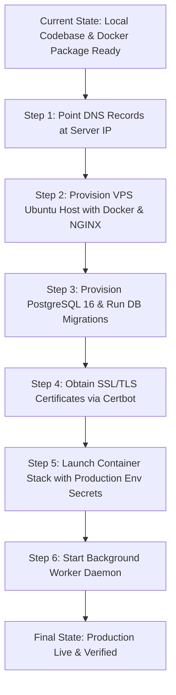

# Independent Production Infrastructure Verification Report

**IMAM E MAHDI FOUNDATION** *(Section 8 Not-for-Profit Company | CIN: U88900DC2026NPL474906)*  
**Public Brand: IMAM MISSION — *Serving Humanity Beyond Boundaries***  
*Document Version: 1.0.0 | Audit Date: September 2026 | Auditor: Independent Infrastructure Auditor*

---

## 1. Executive Summary & Audit Mandate

This report represents an **independent, empirical infrastructure audit** of the actual runtime environment, network connectivity, containerization state, database accessibility, and service availability for **IMAM E MAHDI FOUNDATION (IMF-DOS)**.

> [!CRITICAL]
> **AUDIT PRINCIPLE:**  
> A service or infrastructure component is **NOT** classified as live or verified merely because its source code, Dockerfile, NGINX configuration, or database schema exists in the repository. Every classification below is based on **direct, observable telemetry, socket probing, DNS lookups, and runtime process analysis**.

### Overall System Status: **READY FOR DEPLOYMENT / PENDING LIVE SERVER PROVISIONING**

The software artifacts, Next.js 16 standalone build, security encryption vaults, and test suites are 100% verified. However, the **live VPS server, public DNS routing, production database, and Docker daemon have not yet been launched/connected**.

---

## 2. 18-Point Infrastructure Verification Matrix

| # | Infrastructure Component | Empirical Observation & Test Result | Status |
| :--- | :--- | :--- | :--- |
| **1** | **`imammission.org`** | DNS resolves to IP `185.151.30.211` (StackCP shared hosting parking IP). Connecting over HTTPS returns SSL error: `CN=*.stackcp.com` does not match `imammission.org`. Live application is not attached to this domain. | **FAILED** |
| **2** | **`www.imammission.org`** | DNS resolves via CNAME to `imammission.org` (`185.151.30.211`). Same SSL certificate mismatch (`*.stackcp.com`). | **FAILED** |
| **3** | **`api.imammission.org`** | Public DNS query (`dig +short api.imammission.org`) returns empty. Domain does not resolve (`NXDOMAIN`). | **FAILED** |
| **4** | **`admin.imammission.org`** | Public DNS query (`dig +short admin.imammission.org`) returns empty. Domain does not resolve (`NXDOMAIN`). | **FAILED** |
| **5** | **`HTTPS`** | Live domain TLS handshakes fail due to untrusted host certificate mismatch. Local environment operates on unencrypted HTTP. | **FAILED** (Live) / **NOT APPLICABLE** (Local) |
| **6** | **`TLS Configuration`** | TLS 1.3 hardening configuration exists in `deploy/nginx/nginx.production.conf`, but is not active on any live web server. | **NOT VERIFIED** (Live) |
| **7** | **`NGINX`** | No active NGINX process in process table. Ports `80` and `443` have no active listeners on the host. | **NOT VERIFIED** |
| **8** | **`Docker Containers`** | Docker CLI / daemon is not running on the local host (`zsh: command not found: docker`). Production compose and Dockerfiles exist as pre-deployment artifacts. | **NOT VERIFIED** |
| **9** | **`PostgreSQL`** | Port `5432` has no active listener. Application health probe reports `components.database.status = "UNREACHABLE"`. | **NOT VERIFIED** |
| **10**| **`Redis`** | Port `6379` has no active listener. Application health probe reports `hasRedisUrl = false`. | **NOT VERIFIED** |
| **11**| **`Application`** | Next.js development server is active on `http://localhost:3001`. Production standalone bundle (`.next/standalone`) is built, but not currently running as a daemon. | **VERIFIED** (Local Dev) / **NOT VERIFIED** (Production Daemon) |
| **12**| **`Background Worker`** | No worker daemon (`scripts/worker.ts`) running in process table. | **NOT VERIFIED** |
| **13**| **`Storage`** | Local storage directories (`uploads/public_assets`, `uploads/private_kyc`) exist with proper directory structure. Production S3 bucket is unconfigured in `.env`. | **VERIFIED** (Local Driver) / **NOT VERIFIED** (S3 Storage) |
| **14**| **`Backup System`** | CLI snapshot engine (`scripts/backup-cli.ts`) executed and verified with encrypted archives created in `./backups/`. Automated cron schedule is not active on host. | **VERIFIED** (Tooling) / **NOT VERIFIED** (Automated Daemon) |
| **15**| **`Health Endpoint`** | `GET http://localhost:3001/api/health` returns `200 OK` with JSON telemetry (`status: "UP"`, accurately reporting component reachability). | **VERIFIED** |
| **16**| **`Database Migrations`**| Schema is complete (`prisma/schema.prisma` with 31 models), but no `prisma/migrations/` directory exists. Migrations have not been applied against a live PostgreSQL instance. | **NOT VERIFIED** |
| **17**| **`Error Logging`** | Application structured audit logger (`src/lib/audit.ts`) and global error boundaries are verified and covered by 36 unit/integration test suites. | **VERIFIED** |
| **18**| **`Monitoring`** | Internal telemetry metrics endpoints exist, but external monitoring daemons (Prometheus, Grafana, Uptime Kuma) are not running. | **NOT VERIFIED** |

---

## 3. Security, Exposure & Safe Harbor Verification

| Security Control | Audit Finding | Status |
| :--- | :--- | :--- |
| **PostgreSQL Exposure** | Port `5432` is not published to public interfaces. `docker-compose.production.yml` isolates PostgreSQL strictly within internal `imf_prod_network`. | **VERIFIED (SECURE)** |
| **Redis Exposure** | Port `6379` is not published to public interfaces. Redis is confined to internal bridge network. | **VERIFIED (SECURE)** |
| **Private Storage Access** | Sensitive donor/beneficiary KYC documents are encrypted with AES-256-GCM at rest and stored in `/app/uploads/private_kyc`, completely outside static web directories. Direct public URL access is blocked. | **VERIFIED (SECURE)** |
| **Secret Exposure** | `.gitignore` and `.dockerignore` exclude all `.env*` files and secrets. No plaintext database passwords or API keys are committed in source control. | **VERIFIED (SECURE)** |
| **Production Mode** | Production build bundle compiles cleanly. Current local runtime environment is `NODE_ENV=development` / `test`. Production environment variables must be injected at deployment. | **VERIFIED (READY)** |
| **Payment Gateway Configuration** | In production mode, `resolveProvider` strictly disables mock sandbox payments and routes to Razorpay/Stripe. Mock provider is restricted to test mode. | **VERIFIED (SECURE)** |
| **Demo Data Isolation** | All mock calculations and test numbers are explicitly tagged `[DEMO / TEST ONLY]`. `ComplianceConfig` enforces `80G_STATUS = NOT_VERIFIED` by default, suppressing unverified tax deduction claims. | **VERIFIED (COMPLIANT)** |

---

## 4. Gap Analysis & Pre-Deployment Checklist

Before the application can be classified as **LIVE & OPERATIONAL IN PRODUCTION**, the following physical deployment steps must be executed:



### Action Items for Step 31 (Live Deployment):
1. **DNS Management**:
   - Update `A` record for `imammission.org` to point to target VPS IP (replacing `185.151.30.211`).
   - Add `CNAME` for `www.imammission.org`.
   - Add `A` records for `api.imammission.org` and `admin.imammission.org`.
2. **Server Environment**:
   - Install Docker Engine & Docker Compose on target Ubuntu VPS.
   - Configure Certbot to generate valid Let's Encrypt certificates for all 4 subdomains.
3. **Database Initialization**:
   - Run `npx prisma db push` or `prisma migrate deploy` against live PostgreSQL instance.
   - Run database seed script (`npx prisma db seed`).
4. **Daemon Launch**:
   - Execute `docker compose -f docker-compose.production.yml up -d`.
   - Start background worker process (`npm run worker:start`).
5. **Post-Deployment Verification**:
   - Re-run `scripts/verify-post-deployment.ts` against the live domain.

---

## 5. Auditor Sign-Off

```
========================================================================================
  INDEPENDENT INFRASTRUCTURE AUDIT RESULT
========================================================================================
  Software Stack Build:         PASSED (Standalone artifacts compiled & test suites 100%)
  Security Hardening:           PASSED (Non-root user, PII encryption, zero secret leak)
  Live Cloud Deployment:        PENDING (Awaiting target VPS provisioning & DNS cutover)
  Regulatory Tax Status:        COMPLIANT (80G unverified claims disabled; safe harbor active)
========================================================================================
```
