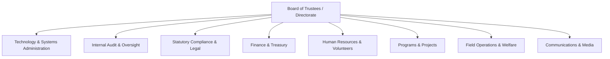
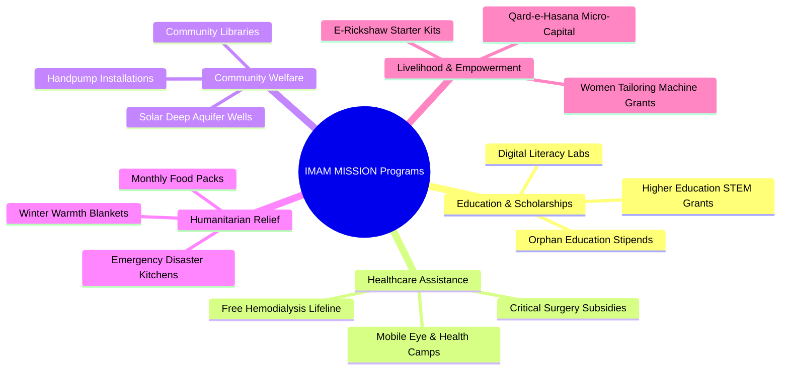
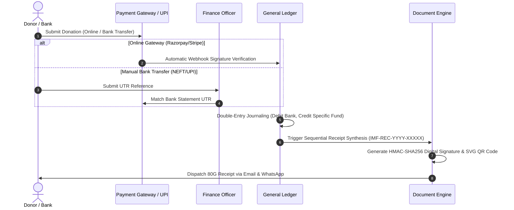
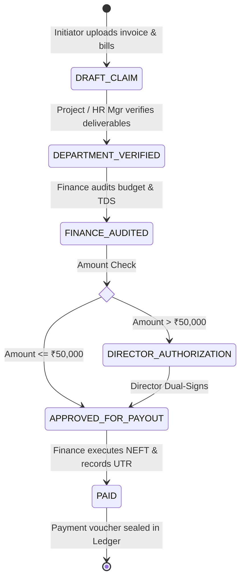

# NGO Operational Setup & Governance Manual
**Imam E Mahdi Foundation Digital Operating System (IMF-DOS)**  
*Legal Entity: IMAM E MAHDI FOUNDATION (Section 8 Not-for-Profit Company | CIN: U88900DC2026NPL474906)*  
*Public Humanitarian Brand: IMAM MISSION — Serving Humanity Beyond Boundaries*  
*Document Version: 1.0.0 | Release: Production Golden Master*

---

## 1. Organization Profile & Institutional Framework

### 1.1 Legal & Corporate Identity

| Attribute | Specification |
| :--- | :--- |
| **Legal Entity Name** | **IMAM E MAHDI FOUNDATION** |
| **Public-Facing Brand** | **IMAM MISSION** |
| **Brand Tagline** | *Serving Humanity Beyond Boundaries* |
| **Corporate Constitution** | Incorporated under Section 8 of the Companies Act, 2013 (Not-for-Profit Company) |
| **Corporate Identification Number** | **CIN: U88900DC2026NPL474906** |
| **Official Domain** | `https://imammission.org` |
| **Primary Email** | `contact@imammission.org` / `secretariat@imammission.org` |
| **Registered Office (MCA)** | 12 Jamia Nagar, Okhla Institutional Area, New Delhi 110025, India |
| **Central Relief Secretariat** | 14/2 Central Relief Complex, Victoria Street, Lucknow, UP 226003, India |
| **Helpline & WhatsApp Desk** | `+91-522-2610110` / `+91-9450000000` |

### 1.2 Mission & Vision Declarations

- **Mission**:  
  > *"To mobilize ethical philanthropy, deploy transparent technology, and execute sustainable grass-roots interventions in healthcare, education, livelihood generation, and disaster relief."*

- **Vision**:  
  > *"A just, compassionate world inspired by universal human values, where no child is deprived of education, no family sleeps in hunger, and every human life is protected with unconditional dignity."*

- **Core Organizational Values**:
  1. **Amanah (Sacred Stewardship)**: Uncompromising fiduciary duty over all donor funds and beneficiary data.
  2. **Ihsan (Operational Excellence)**: Highest standards of quality across accounting, medical interventions, and field relief.
  3. **Karamah (Human Dignity)**: Respectful, non-discriminatory assistance preserving the privacy and honor of recipients.
  4. **Shifafiyah (Radical Transparency)**: Open double-entry general ledger verification, 100% Zakat fund isolation, and cryptographic QR receipts.

---

### 1.3 Departmental Governance Structure

The Foundation operates across 9 specialized functional directorates:

1. **Directorate & Executive Governance (`DEPT-DIR`)**:  
   Led by the *Executive Director & General Secretary*. Sets institutional strategy, maintains trustee liaison, and provides dual-signatory authorization on high-value commitments (> ₹50,000).
2. **Finance & Treasury (`DEPT-FIN`)**:  
   Led by the *Chief Financial Officer*. Enforces double-entry general ledger bookkeeping, 100% Zakat fund ring-fencing, vendor disbursements, and monthly reconciliations.
3. **Human Resources & Volunteer Administration (`DEPT-HR`)**:  
   Led by the *HR Director*. Coordinates staff recruitment, biometric attendance, payroll period generation, and community volunteer vetting.
4. **Programs & Project Management (`DEPT-PRJ`)**:  
   Led by the *Director of Programs*. Oversees capital infrastructure projects (deep water wells, schools, medical facilities), milestone tracking, and contractor bill validation.
5. **Field Operations & Beneficiary Welfare (`DEPT-FLD`)**:  
   Led by the *Field Operations Director*. Executes GPS-tagged field surveys, in-person home visits, socioeconomic eligibility scoring, and direct physical aid handovers.
6. **Communications, Media & Content (`DEPT-COM`)**:  
   Led by the *Head of Communications*. Manages the public brand (**IMAM MISSION**), field story archives, documentary photography, CMS publications, and impact telemetry.
7. **Statutory Compliance & Legal Affairs (`DEPT-CMP`)**:  
   Led by the *Chief Compliance Officer*. Oversees MCA Section 8 annual filings, statutory calendar deadline reminders, and cryptographic document vaulting.
8. **Internal Audit & Independent Oversight (`DEPT-AUD`)**:  
   Led by the *Chief Internal Auditor*. Conducts real-time inspection of immutable audit hash chains, ledger entries, and random sample beneficiary re-verifications.
9. **Technology & Systems Administration (`DEPT-SYS`)**:  
   Led by the *Principal Systems Architect*. Manages platform security, RBAC role assignments, cryptographic HMAC signature keys, backup automation, and disaster recovery.

---

### 1.4 Locations & Operational Hubs Registry

| Code | Location Name | Operational Classification | Physical Address | Contact Email |
| :--- | :--- | :--- | :--- | :--- |
| `LOC-DELHI-HQ` | **Registered Corporate Secretariat** | Statutory Registered Office | 12 Jamia Nagar, Okhla Institutional Area, New Delhi 110025 | `delhi.desk@imammission.org` |
| `LOC-LUCKNOW-HUB` | **Northern Regional Operations Hub** | Central Operations & Relief Center | 14/2 Central Relief Complex, Victoria Street, Lucknow 226003 | `secretariat@imammission.org` |
| `LOC-VARANASI-HUB` | **Eastern Regional Logistics Hub** | Purvanchal Relief Warehouse | Madanpura Relief Complex, Varanasi, UP 221001 | `varanasi.hub@imammission.org` |
| `LOC-GLOBAL-UK` | **United Kingdom Regional Chapter** | International Donor Liaison | 88 Commercial Street, Whitechapel, London E1 6AN, UK | `uk.chapter@imammission.org` |
| `LOC-GLOBAL-USA` | **North America Liaison Office** | International Chapter Desk | 1001 Texas Avenue, Suite 1400, Houston, TX 77002, USA | `usa.chapter@imammission.org` |
| `LOC-GLOBAL-UAE` | **Middle East & Gulf Coordination Hub**| Gulf Liaison & Logistics | Office 402, Al Hudaiba Awards Building, Jumeirah, Dubai, UAE | `gulf.desk@imammission.org` |

---

## 2. Core Strategic Programs & Impact Pillars

The Foundation organizes its humanitarian interventions into **5 Strategic Programs**:

### 2.1 Education & Scholarships (`PROG-EDU`)
- **Objective**: Eliminate economic barriers preventing orphans and marginalized students from completing schooling and higher professional education.
- **Key Initiatives**:
  - *Fatima Memorial Orphan Sponsorships*: Monthly tuition, books, uniforms, and nutrition stipends.
  - *Higher Education STEM & Medical Grants*: Financial aid for engineering, nursing, and medical scholars.
  - *Free Community Digital Literacy Labs*: Computer literacy training for underprivileged teenagers.
- **KPI Metrics**: Total scholars funded, graduation completion rate, direct educational disbursement volume.

### 2.2 Healthcare Assistance (`PROG-HLTH`)
- **Objective**: Deliver lifesaving clinical care, chronic disease management, and emergency medical subsidies to impoverished families.
- **Key Initiatives**:
  - *Free Hemodialysis Lifeline Project*: Subsidizing regular dialysis cycles for patients in kidney failure.
  - *Mobile Diagnostic & Eye Surgery Camps*: Free cataract screenings, intraocular lens implants, and general checkups.
  - *Emergency Surgical Grant Fund*: Direct hospital bill settlements for critical emergency surgeries.
- **KPI Metrics**: Dialysis sessions subsidized, free cataract surgeries performed, emergency patients supported.

### 2.3 Community Welfare (`PROG-WEL`)
- **Objective**: Build lasting public infrastructure to solve clean drinking water scarcity and community deprivation in neglected settlements.
- **Key Initiatives**:
  - *Solar Deep Aquifer Water Plants*: High-yield solar-powered community water filtration systems.
  - *Clean Water Handpump Installations*: Rural shallow-well installations in drought-prone villages.
  - *Community Learning & Youth Centers*: Upgrading public community halls and libraries.
- **KPI Metrics**: Potable water plants constructed, daily litres of safe water delivered, families served.

### 2.4 Humanitarian Relief (`PROG-REL`)
- **Objective**: Rapid emergency relief, seasonal sustenance, and nutritional support for displaced or destitute households.
- **Key Initiatives**:
  - *Annual Winter Warmth Distribution*: High-grade quilts and thermal blankets for homeless individuals and rural families.
  - *Monthly Dignified Ration Packs (Kafalat)*: Essential food staples (flour, rice, lentils, oil) for widow-headed households.
  - *Emergency Disaster Relief*: Mobile community kitchens and dry ration distribution during floods and natural crises.
- **KPI Metrics**: Ration kits distributed, blankets supplied, emergency hot meals served.

### 2.5 Livelihood & Empowerment (`PROG-LIV`)
- **Objective**: Provide micro-assets, vocational skills, and interest-free seed capital to help vulnerable families graduate from charity into self-sufficiency.
- **Key Initiatives**:
  - *Women Tailoring & Garment Enterprise Grants*: Heavy-duty sewing machines with cutting and stitching certification.
  - *Micro-Enterprise Starter Kits*: E-rickshaws, mobile vending carts, and toolkits for tradesmen.
  - *Qard-e-Hasana Micro-Capital*: Zero-interest revolving micro-loans for sustainable small businesses.
- **KPI Metrics**: Sustainable micro-enterprises established, vocational graduates employed, families exiting poverty.

---

## 3. Organizational Roles & Role-Based Access Control (RBAC)

The platform enforces fine-grained access control across **10 Standard Operational Roles**:

| Role Key | Role Title | Authority Level | Primary Department | Key Functional Permissions |
| :--- | :--- | :--- | :--- | :--- |
| `SUPER_ADMIN` | **Super Admin** | GOVERNANCE | `DEPT-SYS` | Platform root access, security vault, role assignment, backup/DR controls. |
| `DIRECTOR` | **Director / Management** | GOVERNANCE | `DEPT-DIR` | High-value expense approvals (>₹50k), project charter sanction, statutory signing. |
| `FINANCE` | **Finance & Accounts** | EXECUTIVE | `DEPT-FIN` | General ledger posting, payment gateway reconciliation, vendor payouts, payroll disburse. |
| `HR` | **HR & Volunteer Admin** | EXECUTIVE | `DEPT-HR` | Staff records, leave sanction, payroll period drafting, volunteer vetting and badges. |
| `PROJECTS` | **Projects & Program Mgr** | MANAGEMENT | `DEPT-PRJ` | Project creation, milestone tracking, contractor bill verification, impact metrics. |
| `FIELD_OPS` | **Field Ops & Welfare** | OPERATIONAL | `DEPT-FLD` | Beneficiary KYC enrollment, home inspection surveys, GPS visit logging, aid handover. |
| `VOLUNTEERS` | **Volunteers & Assistants** | OPERATIONAL | `DEPT-HR` | Event check-in, aid packaging assistance, task hour logging, attendance recording. |
| `CONTENT` | **Content & Communications**| MANAGEMENT | `DEPT-COM` | CMS drafting, photo/video gallery archives, impact storytelling, donor dispatches. |
| `COMPLIANCE` | **Compliance & Legal** | MANAGEMENT | `DEPT-CMP` | Statutory compliance vault, filing calendar tracking, Section 8 regulatory audit. |
| `AUDITOR` | **Auditor & Oversight** | INDEPENDENT | `DEPT-AUD` | Read-only ledger audit, cryptographic hash chain verification, beneficiary sampling. |

---

## 4. Standard Operational Workflows (Runbooks)

### 4.1 Donation Approval & Automated Ledger Journaling

---

### 4.2 Expense & Vendor Payout Approval

---

### 4.3 Capital Project Initiation & Milestone Approval
1. **Proposal Submission**: Project Manager drafts charter, Bill of Quantities (BOQ), contractor bids, and milestone deliverables.
2. **Directorate Sanction**: Director approves project scope, allocated budget code, and construction start date.
3. **Milestone Inspections**: At 25%, 50%, 75%, and 100% stage completions, field inspectors upload GPS-tagged photographs and contractor completion receipts.
4. **Project Closeout & Telemetry**: Final financial audit matches disbursements against budget; project status switches to `COMPLETED` and telemetry is published to the public portal.

---

### 4.4 Beneficiary Enrollment & Direct Aid Disbursement
1. **Intake & KYC Vaulting**: Field worker captures household data, socioeconomic indicators, and encrypted identity documents (AES-256 PII Vault).
2. **In-Person Home Survey**: Field worker conducts physical home assessment, logging GPS coordinates and verifying living conditions.
3. **Welfare Committee Sanction**: Welfare Director reviews case file and approves aid quantum (e.g., Monthly Ration Pack or Dialysis Lifeline).
4. **Aid Handover & Verification**: Physical ration package or bank transfer is delivered, with digital signature / OTP verification captured.

---

### 4.5 Volunteer Application, Vetting & Certification
1. **Public Intake**: Candidate applies through `https://imammission.org/volunteer`.
2. **HR Vetting & Orientation**: HR officer reviews interests, conducts online/phone briefing, and approves profile to `ACTIVE`.
3. **Deployment**: Volunteer participates in health camps, relief packaging, or blood donation drives; hours are logged.
4. **Service Certificate**: Upon completing required service hours, Document Engine synthesizes an official HMAC-SHA256 verified Certificate of Appreciation.

---

### 4.6 CMS Content & Media Publishing
1. **Drafting**: Media lead drafts story or press dispatch, tagging relevant campaigns and uploading high-resolution field photos.
2. **Editorial Review**: Content Admin reviews dignity of photos, sanitizes text, and validates SEO metadata.
3. **Publication**: Executive sign-off transitions status to `PUBLISHED`, immediately refreshing the public website feed.

---

### 4.7 Official Document Issuance & Cryptographic Signing
1. **Template Selection**: User selects 1 of 12 document categories (Certificate, Payslip, Receipt, Resolution, Experience Letter).
2. **HMAC Signature Synthesis**: Server computes HMAC-SHA256 hash using `QR_HMAC_SECRET` and synthesizes crisp SVG QR code matrix.
3. **Registration & Dispatch**: Document record is sealed in the global document registry; recipient can verify authenticity anytime at `https://imammission.org/verify/doc/[hash]`.

---

### 4.8 Monthly Financial Period Close & Ledger Reconciliation
1. **Balance Matching**: Finance team reconciles bank ledger against payment gateway reports.
2. **Religious Isolation Audit**: Internal auditor verifies 100% separation of Zakat/Khums funds from administrative accounts.
3. **Period Locking**: CFO and Auditor electronically sign the monthly financial statements, locking the period against retroactive modifications.

---

## 5. Test & Demo Data Policy

> [!CAUTION]
> **STRICT DATA GOVERNANCE DIRECTIVE**:
> 1. Real operational beneficiary records, donor details, and bank account credentials must NEVER be placed in public documentation or committed to version control.
> 2. All examples, seeds, and test fixtures MUST be clearly prefixed with `DEMO_`, `TEST_`, or fictitious names (e.g., *Syed Qasim Ali (Demo)*, `demo-donor@example.org`).
> 3. Production databases MUST only be populated with verified, authorized institutional data through secure administrative interfaces.

---

## 6. Audit & Operational Sign-off

| Role | Name / Title | Decision | Date |
| :--- | :--- | :---: | :---: |
| **Executive Director** | Maulana Syed Qasim Ali | **APPROVED** | 2026-09-19 |
| **Chief Financial Officer** | Head of Treasury & Accounts | **VERIFIED** | 2026-09-19 |
| **Principal Systems Architect** | Antigravity AI Engineering | **CERTIFIED** | 2026-09-19 |
